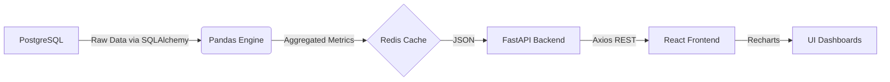
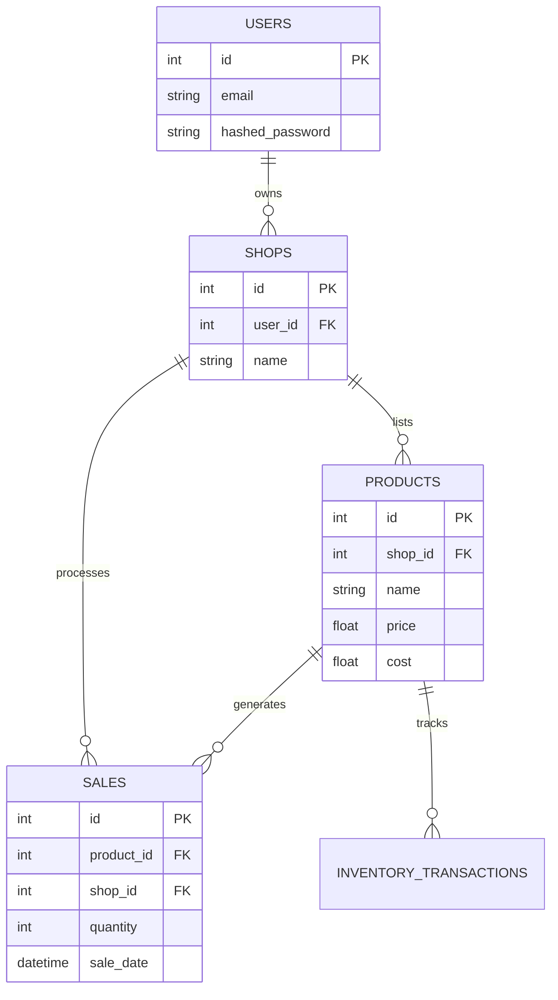

# ShubhLabh360: System Architecture Deep Dive

This document serves as a comprehensive technical audit and architectural blueprint of the ShubhLabh360 platform. It details the system's structure, data flows, machine learning pipelines, and security mechanisms.

---

## 1. High-Level Architecture Overview

ShubhLabh360 is built as a monolithic web application structured around a modern decoupled client-server architecture. 

**Tech Stack:**
*   **Frontend:** React (Vite), Tailwind CSS, Recharts, Lucide-React.
*   **Backend:** FastAPI (Python), Pandas, XGBoost, Scikit-learn, LangChain.
*   **Databases & Caching:** PostgreSQL (Primary OLTP), Redis (Caching & ephemeral states).
*   **Orchestration:** Designed for Docker Compose (PostgreSQL & Redis run in containers).

**Data Flow Architecture:**


1.  **Storage layer:** Raw relational data is fetched from PostgreSQL.
2.  **Processing layer:** Heavy numerical aggregations are executed in-memory using Pandas.
3.  **Caching layer:** Processed DataFrames (converted to JSON) are cached in Redis to minimize repetitive database queries and Pandas compute cycles.
4.  **Transport layer:** FastAPI securely delivers the JSON payloads over REST.
5.  **Presentation layer:** React and Recharts visualize the JSON data dynamically.

---

## 2. Database Schema & Data Seeding

The platform utilizes a strictly typed, relational database schema built with SQLAlchemy ORM.

**Entity Relationship Diagram:**


**Data Seeding Strategy (`generate_synthetic_ml.py`):**
To train the ML models properly, a custom synthetic data generator seeds the database with 12 months of historical data. It injects specific edge cases to test model robustness:
*   **Viral Spikes:** 300% artificial volume bumps over 2-3 days.
*   **Out-of-Stock Events:** Intermittent 5-day periods with zero sales.
*   **Macro Downtrends:** Multi-month linear degradation in specific categories.
*   **Anomalous Margins:** High sales volume combined with artificially lowered profits to trigger anomaly detection.

---

## 3. Core Analytics Engine (Pandas & Redis Caching)

The backend relies on the Pandas library for rapid, vectorized data manipulation rather than writing complex, multi-join SQL queries.

**Processing Workflow (`services/analytics_service.py`):**
1.  **Data Ingestion:** SQLAlchemy queries return ORM objects which are instantly converted into Pandas DataFrames.
2.  **Aggregation:** Data is grouped by product or date (`df.groupby(df['sale_date'].dt.date)`).
3.  **Resampling:** Time-series gaps are filled using `.asfreq('D')` or `.reindex()` to ensure continuous timelines.
4.  **Feature Calculation:** Profit margins and rolling metrics are calculated via vectorized columns (`df['profit'] = df['revenue'] - df['cost']`).

**Redis Integration:**
To prevent bottlenecking the API during complex aggregations, the results of the Pandas processing are cached in Redis.
*   A `15-minute Time-To-Live (TTL)` is applied to endpoint responses (e.g., `/analytics/revenue`).
*   This ensures dashboards load instantly while data remains relatively real-time.

---

## 4. Machine Learning & Forecasting Pipeline

The platform leverages two distinct Machine Learning pipelines for predictive and prescriptive analytics.

### XGBoost Forecaster (`forecasting.py`)
Predicts 7-day future demand curves for individual products.
*   **Feature Engineering:** The historical timeline is enriched with features like `day_of_week`, `month`, and `is_weekend`. 
*   **Autoregressive Lags:** We inject `lag_1_day` and `lag_7_day` features to allow the model to recognize sudden spikes and weekly cyclic patterns.
*   **Hyperparameter Tuning:** `RandomizedSearchCV` is utilized during training to dynamically find the optimal `max_depth`, `learning_rate`, and `n_estimators`.
*   **Iterative Prediction:** The model predicts day `T+1`, appends it to the historical feature set, and uses that new set to predict `T+2`, repeating for 7 days.

### Isolation Forest (`anomaly_detection.py`)
An unsupervised anomaly detection model that scans overall shop performance to flag unexpected drops or spikes.
*   **Preprocessing:** The data (daily revenue, daily profit margin) is scaled using Scikit-Learn's `StandardScaler`—this is critical as Isolation Forests perform significantly better on normalized numerical dimensions.
*   **Execution:** The algorithm isolates outliers based on a tuned `contamination` parameter, successfully flagging the "Anomalous Margins" injected by the seeding script.

---

## 5. GenAI Text-to-SQL Interface

The AI Assistant tab allows users to query their relational database using natural language.

**Pipeline (`services/ai_service.py`):**
1.  **LangChain Integration:** The system uses `create_sql_query_chain` bound to a `SQLDatabase` connection and an LLM (Gemini 3.6 Flash / GPT-4o-mini).
2.  **Query Generation:** The LLM inspects the PostgreSQL schema and translates a natural language question (e.g., "What was my highest selling item in August?") into an executable SQL query.
3.  **Sanitization:** A custom `strip_sql_markdown` function actively removes ` ```sql ` markdown blocks to prevent execution failures in SQLAlchemy.
4.  **Execution & Explanation:** The query executes, and the raw SQL output is passed back into the LLM through a `StrOutputParser` chain to generate a conversational human-readable answer.

**Graceful Error Handling:**
If the external LLM provider hits a rate limit (e.g., `429 RESOURCE_EXHAUSTED`), the backend traps the exception. Instead of crashing, it returns a safe fallback JSON object:
`{"error": false, "response": "The AI Assistant is currently resting due to daily API rate limits..."}`

---

## 6. Security & Authentication

The platform employs a robust security model to protect data and user sessions.

*   **Authentication (JWT):** The `/auth/login` endpoint utilizes FastAPI's `OAuth2PasswordBearer` and `passlib` (bcrypt) to verify hashed passwords. Upon success, it issues a signed JSON Web Token (JWT) using the `HS256` algorithm.
*   **API Security:** All protected endpoints require a `Depends(get_current_user)` injection. The backend decodes the JWT and validates the user session before serving data.
*   **OTP & SMTP:** Redis is used to store temporary 6-digit OTPs (One Time Passwords) for password resets, assigned a strict 5-minute TTL. `aiosmtplib` dispatches the OTP to the user's registered email.
*   **Frontend Interceptors:** The React frontend utilizes Axios interceptors. If the backend throws a `401 Unauthorized` (e.g., expired token), the interceptor automatically clears the local storage and gracefully redirects the user to the login screen via `react-hot-toast` notifications.

---

## 7. Frontend Design & UX (Tailwind & Recharts)

The UI is built to feel like a premium Boutique SaaS platform, distancing itself from generic templates.

*   **Color Hunt Theme:** The platform utilizes a strictly enforced custom palette injected via `tailwind.config.js`:
    *   `sidebar`: Charcoal (`#222831`)
    *   `canvas`: Light Slate (`#EEEEEE`)
    *   `accent`: Mustard Gold (`#FFD369`)
    *   `card`: Clean White (`#FFFFFF`)
*   **Prescriptive Analytics UI:** Instead of forcing users to interpret abstract machine learning charts, the Inventory page leverages prescriptive analytics. The UI calculates the total predicted volume, peak day, and trend direction. It then surfaces actionable plain-English recommendations (e.g., a Mustard Gold badge stating **"Restock Recommended"**) alongside clean, highly-legible Recharts Bar Charts.
*   **Micro-interactions:** Buttons and chat bubbles utilize subtle hover states, drop shadows, and border-radii adjustments to provide a tactile, human-centric user experience.
